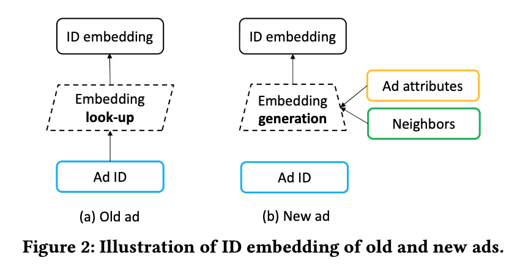
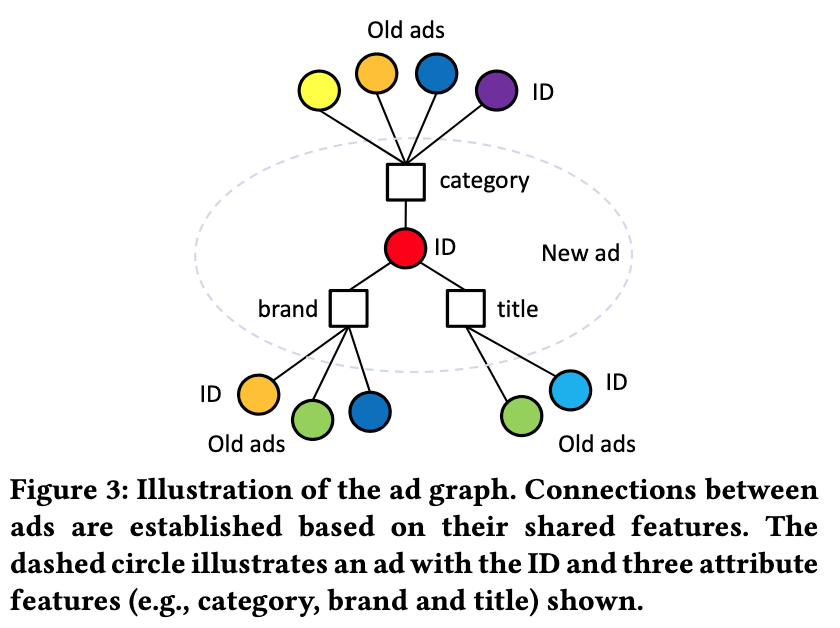
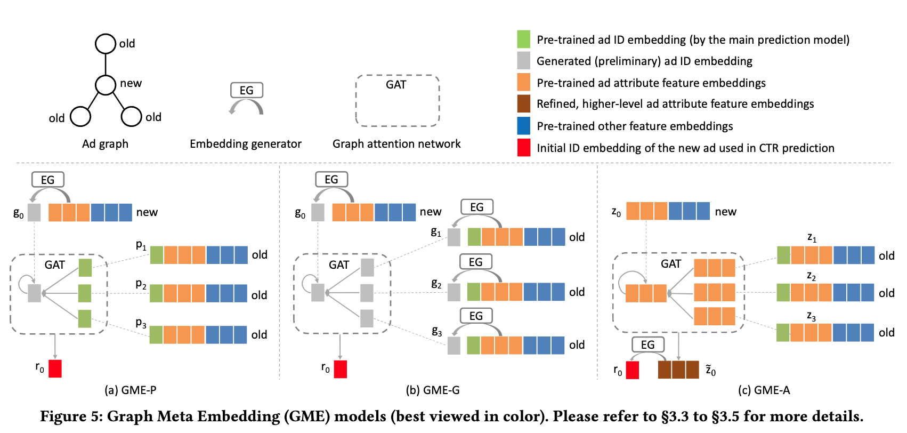

# 推荐系统论文阅读

## AutoML
- AutoCross: Automatic Feature Crossing for Tabular Data in Real-World Applications
--4Paradigm, 2019, [link](https://arxiv.org/pdf/1904.12857.pdf)

- AutoFIS: Automatic Feature Interaction Selection in Factorization Models for Click-Through Rate Prediction
--Huawei, 2020, [link](https://arxiv.org/pdf/2003.11235.pdf)

- AutoFeature: Searching for Feature Interactions and Their Architectures for Click-through Rate Prediction
--Huawei, CIKM2020, [link](https://dl.acm.org/doi/10.1145/3340531.3411912)

- AutoHERI: Automated Hierarchical Representation Integration for Post-Click Conversion Rate Estimation
--Alibaba, 2021, [link](https://dl.acm.org/doi/abs/10.1145/3459637.3482061)

- Towards Automated Neural Interaction Discovery for Click-Through Rate Prediction
--FB, 2020, [link](https://arxiv.org/pdf/2007.06434.pdf)

- FIVES: Feature Interaction Via Edge Search for Large-Scale Tabular Data
--Alibaba, 2021, [link](https://arxiv.org/pdf/2007.14573.pdf)

- SAFE: Scalable Automatic Feature Engineering Framework for Industrial Tasks
--Alibaba, 2020, [link](https://arxiv.org/pdf/2003.02556.pdf)

- Mining Cross Features for Financial Credit Risk Assessment
--CAS, CIKM2021, [link](https://dl.acm.org/doi/abs/10.1145/3459637.3482371)

- AutoIAS: Automatic Integrated Architecture Searcher for Click-Trough Rate Prediction
--Tsinghua, CIKM2021, [link](https://dl.acm.org/doi/abs/10.1145/3459637.3482234)

- AutoInt: Automatic Feature Interaction Learning via Self-Attentive Neural Networks
--Peking, 2018, [link](https://arxiv.org/pdf/1810.11921.pdf)

## Item Cold Start(ICS)
- A Meta-Learning Perspective on Cold-Start Recommendations for Items
--Twitter, 2017, [link](https://static.googleusercontent.com/media/research.google.com/zh-CN//pubs/archive/46346.pdf
)
- Learning to Warm Up Cold Item Embeddings for Cold-start Recommendation with Meta Scaling and Shifting Networks
-- WeChat, 2021, [link](https://arxiv.org/pdf/2105.04790.pdf
)
- Content-aware Neural Hashing for Cold-start Recommendation, SIGIR 2020, [link](https://arxiv.org/pdf/2006.00617.pdf), [code](https://github.com/casperhansen/NeuHash-CF)
- Learning Graph Meta Embeddings for Cold-Start Ads in Click-Through Rate Prediction. --Alibaba, SIGIR2021, [link](https://arxiv.org/pdf/2105.08909.pdf), [code](https://github.com/oywtece/gme)

- Privileged Graph Distillation for Cold Start Recommendation --SIGIR 2021, [link](https://arxiv.org/pdf/2105.14975.pdf)
- Warm Up Cold-start Advertisements: Improving CTR Predictions via Learning to Learn ID Embeddings --中科院, SIGIR2019, [link](https://arxiv.org/pdf/1904.11547.pdf)